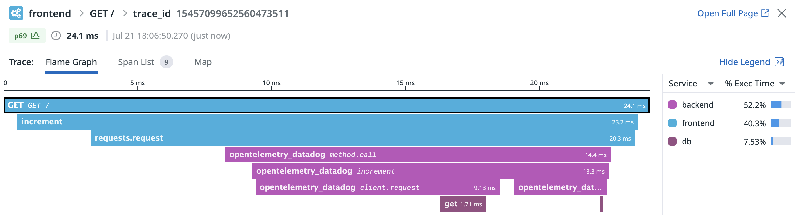

# Datadog Practice

This repository contains a practice project that demonstrates the integration of the Rust library jsonrpsee with Datadog and Python servers.

## Getting Started

Starting a local server at 127.0.0.1:8080.

```shell
$ docker compose up --build
```

## Components Overview



```
 Frontend                                                                  Backend                                                                  DB                 
┌───────────────────────┐          Http Request Headers                   ┌───────────────────────┐         Http Request Headers                   ┌───────────────────────┐
│                       │         ┌─────────────────────────────┐         │                       │        ┌─────────────────────────────┐         │                       │
│   TraceContext        │         │ x-datadog-trace-id          │         │   TraceContext        │        │ x-datadog-trace-id          │         │   TraceContext        │
│ ┌───────────────────┐ │         │                             │         │ ┌───────────────────┐ │        │                             │         │ ┌───────────────────┐ │
│ │ TraceId           │ │         │ x-datadog-parent-id         │         │ │ TraceId           │ │        │ x-datadog-parent-id         │         │ │ TraceId           │ │
│ │                   │ │         │                             │         │ │                   │ │        │                             │         │ │                   │ │
│ │ SpanId            │ │ Inject  │ x-datadog-sampling-priority │ Extract │ │ SpanId            │ │Inject  │ x-datadog-sampling-priority │ Extract │ │ SpanId            │ │
│ │                   ├─┼────────>│                             ├─────────┼>│                   │ ┼───────>│                             ├─────────┼>│                   │ │
│ │ TraceFlags        │ │         │ x-datadog-tags              │         │ │ TraceFlags        │ │        │ x-datadog-tags              │         │ │ TraceFlags        │ │
│ │                   │ │         │                             │         │ │                   │ │        │                             │         │ │                   │ │
│ │ TraceState        │ │         │ traceparent                 │         │ │ TraceState        │ │        │ traceparent                 │         │ │ TraceState        │ │
│ └───────────────────┘ │         │                             │         │ └───────────────────┘ │        │                             │         │ └───────────────────┘ │
│                       │         │ tracestate                  │         │                       │        │ tracestate                  │         │                       │
└───────────────────────┘         └─────────────────────────────┘         └───────────────────────┘        └─────────────────────────────┘         └───────────────────────┘
```

## Future Improvements
- Trace Naming in Backend
- Metrics Integration
  
## Disclaimer
This project is purely for educational and practice purposes.

Please feel free to explore the code, experiment, and make modifications to further your learning and understanding of the technologies involved.

Happy coding! 🚀
